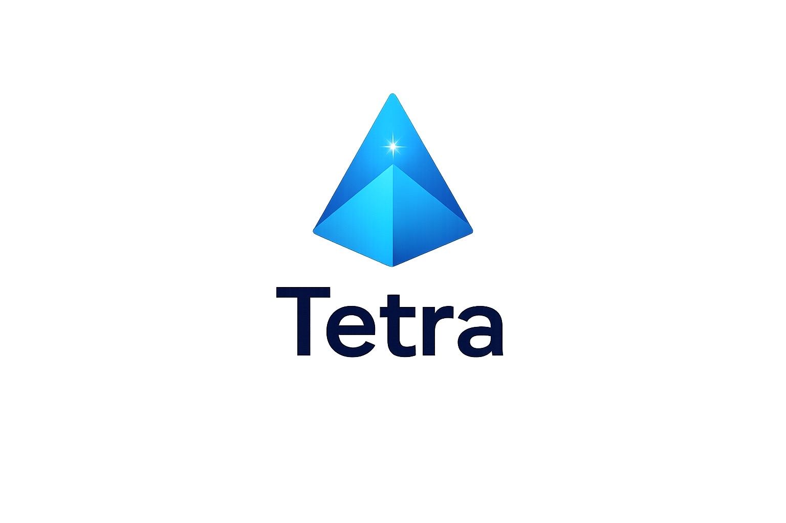

<div align="center">



# 🛡️ Tetra HMS

### Enterprise-grade HMS-plattform for norske virksomheter

**Moderne SaaS for arbeidsmiljøstyring med AI-assistanse, dokumenthåndtering og real-time compliance tracking**

[](https://nextjs.org/)
[](https://react.dev/)
[](https://www.typescriptlang.org/)
[](https://supabase.com/)

[](LICENSE)
[](https://tetra.onl)
[]()

[🚀 Live Demo](https://tetra.onl) • [📖 Dokumentasjon](#-dokumentasjon) • [🐛 Issues](https://github.com/Tetraadm/tetra/issues) • [💬 Diskusjoner](https://github.com/Tetraadm/tetra/discussions)

---

<p align="center">
  <a href="#-quick-start">Quick Start</a> •
  <a href="#-funksjoner">Funksjoner</a> •
  <a href="#-teknologi">Teknologi</a> •
  <a href="#-installasjon">Installasjon</a> •
  <a href="#-api">API</a> •
  <a href="#-deployment">Deployment</a>
</p>

</div>

---

## 🎯 Om Tetra

Tetra er en **moderne, sikker og brukervennlig HMS-plattform** designet spesielt for norske virksomheter. Med AI-drevet søk, intuitiv dokumenthåndtering og robust compliance tracking, gjør Tetra det enkelt å holde oversikt over arbeidsmiljø og sikkerhet.

### 🌟 Hvorfor Tetra?

<table>
<tr>
<td width="33%" align="center">
<h3>🔐 Enterprise Sikkerhet</h3>
<p>Row Level Security, tenant-isolasjon, og GDPR-compliant logging</p>
</td>
<td width="33%" align="center">
<h3>🤖 AI-Drevet</h3>
<p>Claude 3.5 Haiku for naturlig språk Q&A basert på dine dokumenter</p>
</td>
<td width="33%" align="center">
<h3>⚡ Moderne Stack</h3>
<p>Next.js 16, React 19, TypeScript 5 - bygget for hastighet og skalerbarhet</p>
</td>
</tr>
</table>

---

## 🚀 Quick Start

```bash
# 1️⃣ Klon og installer
git clone https://github.com/Tetraadm/tetra.git
cd tetra
npm install

# 2️⃣ Konfigurer miljøvariabler
cp .env.example .env.local
# Rediger .env.local med dine Supabase og Anthropic nøkler

# 3️⃣ Kjør database migrations
# Se "Database Setup" for detaljer

# 4️⃣ Start utviklingsserver
npm run dev
```

**🎉 Åpne [http://localhost:3000](http://localhost:3000) i nettleseren**

> **⚠️ Viktig:** Du må kjøre database-migrasjoner før første gangs bruk (se [Database Setup](#4-database-setup))

---

## ✨ Funksjoner

### 🤖 AI-Assistent "Spør Tetra"

Intelligent Q&A drevet av **Claude 3.5 Haiku**

- ✅ Svarer kun basert på bedriftens egne dokumenter
- ✅ Kontekstuell søk i sikkerhetsinstrukser
- ✅ Automatisk logging for kvalitetssikring
- ✅ Rate limiting og sikkerhet

### 📚 Smart Dokumenthåndtering

Kraftig PDF-behandling og organisering

- ✅ Drag & drop PDF-opplasting
- ✅ Automatisk tekstekstraksjon
- ✅ Mapper og team-organisering
- ✅ Soft delete og versjonshåndtering

### 👥 Multi-tenant Enterprise

Fullstendig tenant-isolasjon

- ✅ Row Level Security (RLS) på alle tabeller
- ✅ Rollebasert tilgang (Admin/Teamleder/Ansatt)
- ✅ Magic link authentication

### 📊 Compliance & Audit

GDPR-compliant revisjonslogging

- ✅ Automatisk aktivitetslogging for alle handlinger
- ✅ Lesebekreftelser for kritiske instrukser
- ✅ 90-dagers data retention policy
- ✅ Eksporterbar audit trail

### 🔔 Real-time Varsler

Intelligent varslingssystem

- ✅ Team-spesifikke sikkerhetsvarsler
- ✅ Prioritetsnivåer (Kritisk/Høy/Normal)
- ✅ Push notifications
- ✅ Varselhistorikk

### ⚡ Performance

Optimalisert for hastighet

- ✅ Server-side rendering med Next.js App Router
- ✅ Incremental static regeneration
- ✅ Edge caching via Vercel
- ✅ Redis rate limiting med Upstash

---

## 🛠️ Teknologi

### Core Stack

| Kategori | Teknologi | Versjon |
|----------|-----------|---------|
| **Framework** | Next.js | 16.1.1 |
| **UI Library** | React | 19.0.0 |
| **Language** | TypeScript | 5.x |
| **Styling** | Tailwind CSS | 3.4.19 |
| **Database** | PostgreSQL (Supabase) | Latest |
| **ORM/Client** | Supabase JS | 2.47.10 |
| **AI** | Anthropic Claude | 3.5 Haiku |

### Infrastructure

| Service | Provider | Purpose |
|---------|----------|---------|
| **Hosting** | Vercel | Edge deployment + CDN |
| **Database** | Supabase | PostgreSQL + Auth + Storage |
| **Auth** | Supabase Auth | Magic Link |
| **Storage** | Supabase Storage | File uploads (PDF, images) |
| **Rate Limiting** | Upstash Redis | Distributed rate limiting |
| **Email** | Resend | Transactional emails |
| **Monitoring** | Vercel Analytics | Performance tracking |

### Development

| Tool | Purpose |
|------|---------|
| **Linting** | ESLint 9 |
| **Type Checking** | TypeScript Compiler |
| **Testing** | Vitest + Playwright |
| **Spell Check** | cspell (norsk + engelsk) |

---

## 📦 Installasjon

### Forutsetninger

Før du starter, sørg for at du har:

- ✅ [Node.js](https://nodejs.org/) **20.x eller høyere** (LTS anbefalt)
- ✅ [npm](https://www.npmjs.com/) **10.x eller høyere**
- ✅ [Supabase-konto](https://supabase.com/) med prosjekt opprettet
- ✅ [Anthropic API-nøkkel](https://www.anthropic.com/)
- 🔧 *Valgfritt:* [Resend-konto](https://resend.com/) for e-post
- 🔧 *Valgfritt:* [Upstash Redis](https://upstash.com/) for production rate limiting

---

### 1. Klon repositoriet

```bash
git clone https://github.com/Tetraadm/tetra.git
cd tetra
```

---

### 2. Installer avhengigheter

```bash
npm install
```

**Installerer:**
- Framework dependencies (Next.js, React)
- Authentication & database (Supabase)
- AI integration (Anthropic SDK)
- UI components (Radix UI, Lucide React)
- Development tools (TypeScript, ESLint, Vitest)

---

### 3. Konfigurer miljøvariabler

```bash
cp .env.example .env.local
```

Rediger `.env.local` og fyll inn **minimum** disse påkrevde variablene:

```env
# ============================================================================
# PÅKREVD - Supabase
# ============================================================================
NEXT_PUBLIC_SUPABASE_URL=https://your-project.supabase.co
NEXT_PUBLIC_SUPABASE_ANON_KEY=eyJ...
SUPABASE_SERVICE_ROLE_KEY=eyJ...

# ============================================================================
# PÅKREVD - AI
# ============================================================================
ANTHROPIC_API_KEY=sk-ant-api03-...

# ============================================================================
# PÅKREVD FOR PRODUCTION - App URL
# ============================================================================
NEXT_PUBLIC_APP_URL=https://tetra.onl
```

> 📝 **Se fullstendig liste:** [Miljøvariabler](#-miljøvariabler)

**Hvor finner jeg disse?**

| Variabel | Hvor å finne |
|----------|--------------|
| Supabase URL & Keys | [Supabase Dashboard](https://app.supabase.com/) → Project Settings → API |
| Anthropic API Key | [Anthropic Console](https://console.anthropic.com/) → API Keys |

---

### 4. Database Setup

Du må kjøre SQL-migrasjoner i Supabase SQL Editor:

**Step-by-step:**

1. **Åpne Supabase SQL Editor**
   - Gå til [Supabase Dashboard](https://app.supabase.com/)
   - Velg ditt prosjekt
   - Klikk **SQL Editor** i sidemenyen

2. **Kjør migrations i rekkefølge**
   
   Start fra `supabase/sql/` mappen og kjør hver fil **i numerisk rekkefølge**:

   ```
   📁 supabase/sql/
   ├── 00_migrations_table.sql       ← Start her
   ├── 01_schema.sql                 
   ├── 02_seed.sql                   
   ├── 03_rls_initial.sql            
   ├── 04_security_helpers.sql       
   ├── ... (03-29 i rekkefølge)
   ├── 29_gdpr_retention.sql
   └── 30_profiles_update_lock.sql         ← Avslutt her
   ```

3. **Verifiser migrasjoner**
   
   ```sql
   -- Sjekk at migrationstabellen finnes
   SELECT * FROM schema_migrations ORDER BY version;
   
   -- Sjekk at hovedtabeller finnes
   \dt
   ```

> **💡 Tips:** Du kan slå sammen alle migrations til én fil:
> ```bash
> cat supabase/sql/*.sql > all_migrations.sql
> ```
> Deretter kjør `all_migrations.sql` i SQL Editor.

---

### 5. Start utviklingsserver

```bash
npm run dev
```

Serveren starter på [http://localhost:3000](http://localhost:3000) 🎉

**Standard innlogging** (etter seed-data):
- **Admin:** Bruk magic link til e-post fra `02_seed.sql`

---

## 🧪 Testing

Vi bruker **Playwright** for End-to-End (E2E) testing av kritiske flyter.

### Kjøre tester

```bash
# 1. Installer browsere (kun første gang)
npx playwright install

# 2. Kjør alle tester
npm run test:e2e
```

**Hva testes?**
- ✅ **Innlogging:** Magic link flow, validering, feilhåndtering
- ✅ **Navigasjon:** Tilgangsstyring, redirects for admin/ansatt
- ✅ **Landingsside:** Verifisering av innhold og lenker
- ✅ **API:** Health checks og responstider

For feilsøking kan du se HTML-rapporten:
```bash
npx playwright show-report
```

---

## 🔧 Miljøvariabler

### 📋 Påkrevde Variabler

| Variabel | Beskrivelse | Hvor å finne |
|----------|-------------|--------------|
| `NEXT_PUBLIC_SUPABASE_URL` | Supabase prosjekt-URL | [Supabase Dashboard](https://app.supabase.com/) → Project Settings → API |
| `NEXT_PUBLIC_SUPABASE_ANON_KEY` | Supabase public anon key | Samme sted ↑ |
| `SUPABASE_SERVICE_ROLE_KEY` | **⚠️ Aldri eksponer til klient!** Service role key | Samme sted ↑ |
| `ANTHROPIC_API_KEY` | Claude API-nøkkel | [Anthropic Console](https://console.anthropic.com/) |
| `NEXT_PUBLIC_APP_URL` | Base URL (production) | `https://tetra.onl` eller din domene |

---

### 🔧 Valgfrie Variabler (med defaults)

<details>
<summary>💡 <b>Klikk for å vise alle valgfrie variabler</b></summary>

#### E-post (Resend)

| Variabel | Default | Beskrivelse |
|----------|---------|-------------|
| `RESEND_API_KEY` | - | Resend API-nøkkel |
| `RESEND_FROM_EMAIL` | `Tetra HMS <onboarding@resend.dev>` | Avsender e-post |

#### Rate Limiting (Upstash)

| Variabel | Default | Beskrivelse |
|----------|---------|-------------|
| `UPSTASH_REDIS_REST_URL` | - | Upstash Redis URL |
| `UPSTASH_REDIS_REST_TOKEN` | - | Upstash Redis token |

> **Fallback:** Hvis ikke satt, brukes in-memory rate limiting (ikke anbefalt for production)

#### AI Configuration

| Variabel | Default | Beskrivelse |
|----------|---------|-------------|
| `AI_RATE_LIMIT` | `20` | Max AI requests per vindu |
| `AI_RATE_WINDOW_SECONDS` | `60` | Rate limit vindu (sekunder) |
| `AI_MIN_RELEVANCE_SCORE` | `0.35` | Minimum relevance score for AI-svar |

#### Upload Configuration

| Variabel | Default | Beskrivelse |
|----------|---------|-------------|
| `UPLOAD_RATE_LIMIT` | `10` | Max uploads per vindu |
| `UPLOAD_RATE_WINDOW_SECONDS` | `60` | Rate limit vindu |
| `MAX_UPLOAD_MB` | `10` | Maksimal filstørrelse (MB) |

#### Invite Configuration

| Variabel | Default | Beskrivelse |
|----------|---------|-------------|
| `INVITE_RATE_LIMIT` | `10` | Max invites per vindu |
| `INVITE_RATE_WINDOW_SECONDS` | `3600` | Rate limit vindu (1 time) |

#### PDF Processing

| Variabel | Default | Beskrivelse |
|----------|---------|-------------|
| `PDF_MAX_PAGES` | `50` | Maksimalt antall sider |
| `PDF_TIMEOUT_MS` | `30000` | Processing timeout (ms) |
| `PDF_MAX_CHARS` | `500000` | Maksimalt antall tegn |

</details>

---

## 📁 Prosjektstruktur

```
tetra/
├── 📂 src/                           # Source code
│   ├── 📂 app/                       # Next.js App Router
│   │   ├── 📂 admin/                 # 🔐 Admin dashboard
│   │   │   ├── AdminDashboard.tsx
│   │   │   ├── components/
│   │   │   ├── hooks/
│   │   │   └── tabs/
│   │   ├── 📂 leader/                # 👔 Team leader dashboard
│   │   ├── 📂 employee/              # 👷 Employee dashboard
│   │   ├── 📂 login/                 # 🔑 Authentication
│   │   ├── 📂 invite/                # 📧 Invite flow
│   │   └── 📂 api/                   # 🌐 API Routes
│   │       ├── ask/                  # AI Q&A endpoint
│   │       ├── upload/               # File upload
│   │       ├── invite/               # User invitations
│   │       ├── confirm-read/         # Read confirmations
│   │       ├── audit-logs/           # Audit log retrieval
│   │       └── health/               # Health check
│   ├── 📂 components/                # ♻️ Shared components
│   │   ├── ui/                       # Base UI components
│   │   └── ...
│   ├── 📂 lib/                       # 🛠️ Utilities & helpers
│   │   ├── supabase/                 # Supabase clients
│   │   ├── types.ts                  # TypeScript types
│   │   ├── ratelimit.ts              # Rate limiting
│   │   └── ui-helpers.ts             # UI utilities
│   └── middleware.ts                 # 🛡️ Auth middleware
├── 📂 supabase/
│   └── 📂 sql/                       # 🗄️ Database migrations (00-29)
├── 📂 public/                        # 📦 Static assets
│   └── tetra-logo.png
├── 📂 tests/                         # 🧪 Tests
│   ├── e2e/                          # Playwright E2E tests
│   └── unit/                         # Vitest unit tests
├── 📂 scripts/                       # 🔧 Utility scripts
│   └── checklist.py                  # Audit script
├── .env.example                      # Environment template
├── package.json                      # Dependencies
├── tsconfig.json                     # TypeScript config
├── tailwind.config.ts                # Tailwind config
├── next.config.ts                    # Next.js config
└── README.md                         # This file! 👋
```

---

## 🗄️ Database

### Entity Relationship Diagram

```
┌─────────────────┐       ┌──────────────┐       ┌──────────────┐
│  organizations  │◄─────┤   profiles   ├──────►│    teams     │
└────────┬────────┘       └──────────────┘       └──────┬───────┘
         │                                               │
         │                                               │
         ▼                                               ▼
┌─────────────────┐       ┌──────────────┐       ┌──────────────┐
│  instructions   │       │    alerts    │       │   invites    │
└─────────────────┘       └──────────────┘       └──────────────┘
         │
         │
         ▼
┌─────────────────┐       ┌──────────────────┐
│instruction_reads│       │  audit_logs      │
└─────────────────┘       └──────────────────┘
```

### Hovedtabeller

| Tabell | Beskrivelse | RLS | Soft Delete |
|--------|-------------|-----|-------------|
| `organizations` | Tenant-organisasjoner | ✅ | ❌ |
| `teams` | Team innenfor organisasjoner | ✅ | ✅ |
| `profiles` | Brukerprofiler (extends `auth.users`) | ✅ | ❌ |
| `instructions` | Sikkerhetsdokumenter (PDFs, etc.) | ✅ | ✅ |
| `folders` | Organisering av instrukser | ✅ | ✅ |
| `alerts` | Sikkerhetsvarsler | ✅ | ✅ |
| `invites` | Brukerinvitasjoner | ✅ | ❌ |
| `instruction_reads` | Lesebekreftelser | ✅ | ❌ |
| `audit_logs` | Aktivitetslogging | ✅ | ❌ |
| `ask_tetra_logs` | AI Q&A historikk | ✅ | ❌ |

---

### Sikkerhetsfunksjoner

#### 🔒 Row Level Security (RLS)

All data er beskyttet med PostgreSQL RLS policies:

```sql
-- Eksempel: Brukere ser kun sin egen organisasjon
CREATE POLICY "Users view own org instructions"
  ON instructions
  FOR SELECT
  USING (org_id = my_org_id());
```

**Helper functions:**
- `my_org_id()` - Returnerer brukerens org_id
- `get_profile_context()` - Security-defined funksjon for profil-lookup
- `get_user_instructions()` - Optimalisert instruksliste

#### 👤 Rollebasert tilgang

| Rolle | Tilgang |
|-------|---------|
| **Admin** | Full kontroll over organisasjon, teams, brukere, instrukser, varsler, audit logs |
| **Teamleder** | Team-scope: administrer team, inviter brukere, håndter teamvarsler |
| **Ansatt** | Read-only: se tildelte instrukser, bekreft lesing, bruk AI-assistent |

#### 🗑️ Soft Delete

Tabeller med `deleted_at` kolonne:
- `instructions`
- `alerts`
- `folders`
- `teams`

```sql
-- Eksempel: Soft delete en instruks
UPDATE instructions 
SET deleted_at = NOW() 
WHERE id = 'uuid';

-- Gjenopprett
UPDATE instructions 
SET deleted_at = NULL 
WHERE id = 'uuid';
```

---

### GDPR Compliance

**Automatisk data retention cleanup:**

```sql
-- Fjern audit logs eldre enn 90 dager
SELECT cleanup_old_audit_logs(90);

-- Fjern AI logs eldre enn 90 dager
SELECT cleanup_old_ask_tetra_logs(90);

-- Eller begge på en gang
SELECT cleanup_all_old_logs(90);
```

> **💡 Anbefaling:** Kjør månedlig via cron eller Supabase Edge Functions

**Funksjoner dokumentert i:** `supabase/sql/29_gdpr_retention.sql`

---

## 🌐 API-dokumentasjon

### Autentisering

Alle API-endepunkter krever autentisering via Supabase session cookie.

**Middleware:** `src/middleware.ts` sjekker auth på alle `/api/*` routes.

---

### POST `/api/ask`

AI-drevet Q&A endepunkt.

**Rate limit:** 20 requests / 60 sekunder (per bruker)

**Request:**
```json
{
  "question": "Hvordan håndterer vi brannfare på kontoret?"
}
```

**Response (success):**
```json
{
  "answer": "Basert på instruksen 'Brannrutiner for kontorlokaler': Ved brannfare skal...",
  "source": {
    "instruction_id": "123e4567-e89b-12d3-a456-426614174000",
    "title": "Brannrutiner for kontorlokaler",
    "updated_at": "2026-01-15T10:00:00.000Z"
  }
}
```

**Response (no context):**
```json
{
  "answer": "Kunne ikke finne relevant informasjon i dokumentene.",
  "confidence": "low"
}
```

**Errors:**
- `429` - Rate limit exceeded
- `401` - Unauthorized
- `500` - Server error

---

### POST `/api/upload`

Last opp instruksdokumenter. **Kun Admin**.

**Rate limit:** 10 uploads / 60 sekunder

**Request:** `multipart/form-data`

```
file: [PDF/TXT/PNG/JPG file, max 10MB]
title: "Brannrutiner"
description: "Oppdaterte brannrutiner for 2026"
severity: "high"
status: "published"
teamIds: ["team-uuid-1", "team-uuid-2"]
folderId: "folder-uuid" (optional)
```

**Response:**
```json
{
  "id": "instruction-uuid",
  "title": "Brannrutiner",
  "file_url": "https://...supabase.co/storage/.../file.pdf"
}
```

**Errors:**
- `400` - Validation error (e.g., file too large, invalid MIME type)
- `403` - Forbidden (not admin)
- `429` - Rate limit exceeded

---

### POST `/api/invite`

Send brukerinvitasjon. **Admin eller Teamleder**.

**Constraints:**
- Teamleder kan kun invitere til sitt eget team
- Teamleder kan kun invitere med rolle `employee`

**Rate limit:** 10 invites / 3600 sekunder (1 time)

**Request:**
```json
{
  "email": "ny.bruker@bedrift.no",
  "role": "employee",
  "team_id": "team-uuid"
}
```

**Response:**
```json
{
  "invite_id": "invite-uuid",
  "email_sent": true
}
```

**Errors:**
- `400` - Email already invited
- `403` - Forbidden (teamleder inviting to wrong team or wrong role)
- `429` - Rate limit exceeded

---

### POST `/api/confirm-read`

Bekreft at bruker har lest en instruks.

**Request:**
```json
{
  "instruction_id": "instruction-uuid"
}
```

**Response:**
```json
{
  "success": true,
  "confirmed_at": "2026-01-19T12:00:00.000Z"
}
```

---

### GET `/api/read-confirmations`

Hent lesebekreftelser for instrukser. **Kun Admin/Teamleder**.

**Query params:**
- `instructionId` (optional) - Filter by instruction

**Response:**
```json
[
  {
    "instruction_id": "uuid",
    "user_id": "uuid",
    "user_email": "bruker@bedrift.no",
    "confirmed_at": "2026-01-19T12:00:00.000Z"
  }
]
```

---

### GET `/api/audit-logs`

Hent audit logs. **Kun Admin**.

**Response:**
```json
[
  {
    "id": "log-uuid",
    "action": "create_instruction",
    "user_id": "user-uuid",
    "user_email": "admin@bedrift.no",
    "details": { "title": "Nye rutiner" },
    "created_at": "2026-01-19T12:00:00.000Z"
  }
]
```

---

### GET `/api/health`

Health check endpoint (uautentisert).

**Response:**
```json
{
  "status": "ok",
  "timestamp": "2026-01-19T12:00:00.000Z"
}
```

---

## 🚀 Deployment

### Vercel (Anbefalt)

[](https://vercel.com/new/clone?repository-url=https://github.com/Tetraadm/tetra)

**Manuell deployment:**

1. **Push til GitHub**
   ```bash
   git push origin main
   ```

2. **Importer i Vercel**
   - Gå til [vercel.com](https://vercel.com)
   - Klikk **New Project**
   - Import fra GitHub: `Tetraadm/tetra`

3. **Konfigurer miljøvariabler**
   
   Legg til alle variabler fra `.env.local` i Vercel:
   - Settings → Environment Variables
   - Legg til hver variabel (kopier fra `.env.local`)

4. **Deploy** 🎉

**Production:** [https://tetra.onl](https://tetra.onl)

---

### Environment Configuration

**Production checklist:**

- ✅ `NEXT_PUBLIC_APP_URL` satt til production domain
- ✅ `SUPABASE_SERVICE_ROLE_KEY` i Vercel secrets (aldri i Git)
- ✅ `ANTHROPIC_API_KEY` i Vercel secrets
- ✅ Upstash Redis konfigurert for production rate limiting
- ✅ Resend konfigurert for e-post


---

## 🔧 Troubleshooting

<details>
<summary><b>❌ Build feiler med TypeScript-feil</b></summary>

**Løsning:**
```bash
# Kjør typecheck isolert
npm run typecheck

# Hvis feil, sjekk at alle dependencies er installert
npm install

# Slett node_modules og reinstaller
rm -rf node_modules package-lock.json
npm install
```

</details>

<details>
<summary><b>❌ Supabase connection feiler</b></summary>

**Sjekk:**
1. `NEXT_PUBLIC_SUPABASE_URL` er korrekt (https://your-project.supabase.co)
2. `NEXT_PUBLIC_SUPABASE_ANON_KEY` matcher prosjektet
3. RLS policies er aktivert (kjør migrasjoner)
4. Prosjektet er ikke paused i Supabase

**Test connection:**
```bash
curl https://your-project.supabase.co/rest/v1/
# Skal returnere 404 eller JSON, ikke connection error
```

</details>

<details>
<summary><b>❌ AI-assistenten svarer ikke</b></summary>

**Vanlige årsaker:**
1. `ANTHROPIC_API_KEY` mangler eller ugyldig
2. Ingen publiserte instrukser i databasen
3. Rate limit truffet (20/min default)

**Feilsøk:**
```sql
-- Sjekk publiserte instrukser
SELECT COUNT(*) FROM instructions WHERE status = 'published';

-- Sjekk AI-logger for feil
SELECT * FROM ask_tetra_logs ORDER BY created_at DESC LIMIT 10;
```

**Test API key:**
```bash
curl https://api.anthropic.com/v1/messages \
  -H "x-api-key: $ANTHROPIC_API_KEY" \
  -H "content-type: application/json" \
  -d '{"model":"claude-3-5-haiku-20241022","max_tokens":10,"messages":[{"role":"user","content":"Hi"}]}'
```

</details>

<details>
<summary><b>❌ Login feiler / Magic link virker ikke</b></summary>

**Sjekk:**
1. Supabase Auth er aktivert i dashboard
2. Magic Link er konfigurert i Auth → Email Templates
3. `NEXT_PUBLIC_APP_URL` er riktig i production
4. E-post levering fungerer (sjekk spam-folder)

**Development:**
- Magic links redirecter til `http://localhost:3000` i dev mode
- Sjekk at du har startet dev server

**Production:**
- Må ha gyldig `NEXT_PUBLIC_APP_URL`
- Sjekk Supabase → Authentication → URL Configuration

</details>

<details>
<summary><b>❌ File upload feiler</b></summary>

**Sjekk:**
1. Filstørrelse under `MAX_UPLOAD_MB` (default 10MB)
2. MIME type støttet (PDF, TXT, PNG, JPG)
3. Storage bucket `instruction_files` eksisterer
4. RLS policies på storage (kjør migrasjon 19-20)

**Feilsøk:**
```sql
-- Sjekk storage policies
SELECT * FROM storage.policies WHERE bucket_id = 'instruction_files';
```

</details>

---

## ❓ FAQ

<details>
<summary><b>Kan jeg bruke Tetra uten AI-funksjoner?</b></summary>

Ja! `ANTHROPIC_API_KEY` er teknisk valgfri. Uten den vil "Spør Tetra"-funksjonen returnere en feilmelding. Du kan fjerne AI-tab fra UI hvis ønskelig.

For å deaktivere AI helt:
- Fjern `employee/components/AskTetraTab.tsx`
- Fjern AI-tab fra `employee/EmployeeApp.tsx`

</details>

<details>
<summary><b>Støttes andre databaser enn Supabase?</b></summary>

**Nei**, Tetra er bygget spesifikt for Supabase ecosystem:
- PostgreSQL + RLS for multi-tenancy
- Supabase Auth for authentication
- Supabase Storage for file uploads

Du kan teoretisk migrere til vanilla PostgreSQL + egen auth, men krever betydelig omarbeiding av:
- `src/lib/supabase/` (auth clients)
- RLS policies → app-level authorization
- Storage → egen file storage løsning

</details>

<details>
<summary><b>Hva er forskjellen på Admin og Teamleder?</b></summary>

| Funksjon | Admin | Teamleder | Ansatt |
|----------|-------|-----------|--------|
| Administrer organisasjon | ✅ | ❌ | ❌ |
| Opprett/slett teams | ✅ | ❌ | ❌ |
| Administrer alle brukere | ✅ | ❌ | ❌ |
| Inviter brukere til eget team | ✅ | ✅ | ❌ |
| Opprett/publiser instrukser | ✅ | ❌ | ❌ |
| Se audit logs | ✅ | ❌ | ❌ |
| Se tildelte instrukser | ✅ | ✅ | ✅ |
| Bekreft lesing | ✅ | ✅ | ✅ |
| Bruk AI-assistent | ✅ | ✅ | ✅ |

</details>

<details>
<summary><b>Er Tetra GDPR-compliant?</b></summary>

**Ja, med betingelser:**

Tetra har:
- ✅ 90-dagers data retention policy
- ✅ Audit trail for all data access
- ✅ Soft delete for gjenoppretting
- ✅ Tenant-isolasjon

**Men du må selv:**
- ⚠️ Kjøre cleanup functions månedlig
- ⚠️ Ha bruksvilkår/personvernerklæring
- ⚠️ Implementere data export-funksjon (ikke i v1)
- ⚠️ Ha databehandleravtale med Supabase/Anthropic

</details>

<details>
<summary><b>Kan jeg white-label Tetra for min bedrift?</b></summary>

Tetra er **proprietary software**. For white-label lisenser, kontakt:

📧 **support@tetra.onl**

Vi tilbyr:
- White-label deployment
- Custom branding
- Self-hosted options
- Enterprise support

</details>

<details>
<summary><b>Hvordan oppdaterer jeg til nyeste versjon?</b></summary>

```bash
# 1. Hent nyeste endringer
git pull origin main

# 2. Installer oppdaterte dependencies
npm install

# 3. Kjør nye migrations (hvis noen)
# Sjekk supabase/sql/ for nye filer

# 4. Rebuild
npm run build
```

**Tips:** Subscribe til GitHub Releases for varsler om nye versjoner.

</details>

---

## 🤝 Bidrag

Vi tar gjerne imot bidrag! 🎉

### Hvordan bidra

1. **Fork** repositoriet
2. **Opprett branch:** `git checkout -b feature/awesome-feature`
3. **Commit endringer:** `git commit -m 'feat: add awesome feature'`
4. **Push:** `git push origin feature/awesome-feature`
5. **Åpne Pull Request**

### Kodestandarder

Før du sender inn PR:

- ✅ Kjør `npm run lint` (0 errors)
- ✅ Kjør `npm run typecheck` (0 errors)
- ✅ Kjør `npm run build` (successful build)
- ✅ All UI-tekst må være på **norsk bokmål**
- ✅ Følg eksisterende kodemønstre
- ✅ Legg til tester for nye funksjoner (hvis relevant)

### Commit Conventions

Vi følger [Conventional Commits](https://www.conventionalcommits.org/):

```
feat: ny funksjon
fix: bugfix
docs: dokumentasjon
refactor: omskriving
test: tester
chore: vedlikehold
perf: ytelsesoptimalisering
style: kodeformatering
```

**Eksempler:**
```
feat: implementer Azure SSO-støtte
fix: rett validering av teamIds i upload API
docs: oppdater README med deployment guide
refactor: splitt AdminDashboard i separate komponenter
```

---

## 📜 Lisens

**Proprietær** - Alle rettigheter forbeholdt.

Ikke tillatt til kommersiell bruk uten lisens.

For lisensiering, kontakt: support@tetra.onl

---

## 📧 Kontakt & Support

<div align="center">

| 🐛 **Bugs** | 💬 **Diskusjoner** | 📧 **E-post** | 🌐 **Nettside** |
|-------------|-------------------|---------------|----------------|
| [GitHub Issues](https://github.com/Tetraadm/tetra/issues) | [GitHub Discussions](https://github.com/Tetraadm/tetra/discussions) | support@tetra.onl | [tetra.onl](https://tetra.onl) |

</div>

---

<div align="center">

### 🛡️ Bygget for norsk arbeidssikkerhet

**Moderne teknologi • Enterprise sikkerhet • GDPR compliance**

[⬆ Tilbake til toppen](#-tetra-hms)

---

**Tetra HMS** • Versjon 0.1.0 • 2026

</div>
