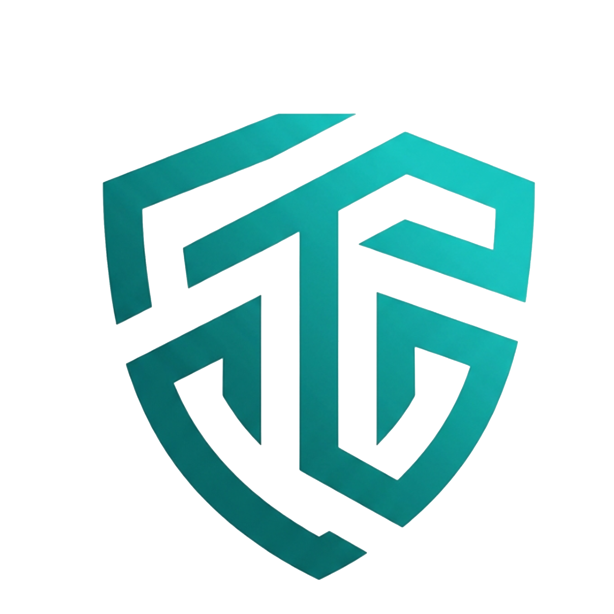

<div align="center">



# Tetrivo HMS

### Fremtidens plattform for trygghet på arbeidsplassen

**Moderne SaaS for HMS-arbeid med AI-assistent, dokumenthåndtering og lesebekreftelse**

[](https://nextjs.org/)
[](https://www.typescriptlang.org/)
[](https://supabase.com/)

[🌐 tetrivo.com](https://tetrivo.com) • [📧 kontakt@tetrivo.com](mailto:kontakt@tetrivo.com)

</div>

---

## 🎯 Om Tetrivo

Tetrivo er en **moderne HMS-plattform** bygget for norske virksomheter. Vi samler internkontroll, dokumenthåndtering og compliance på ett sted – enkelt for de ansatte, oversiktlig for lederne.

### Hvorfor Tetrivo?

|----------|-----------|
| **Framework** | Next.js 16.1, React 19 |
| **Språk** | TypeScript 5 |
| **Database** | PostgreSQL (Supabase) |
| **AI Chat** | Gemini 2.0 Flash (Vertex AI) |
| **AI Embeddings** | Vertex AI `text-multilingual-embedding-002` |
| **PDF OCR** | Google Document AI |
| **E-post** | Resend |
| **Hosting** | Vercel |
| **Rate Limiting** | Upstash Redis |
| **Error Tracking** | Sentry |
| **GDPR** | Automatisk cleanup + sletteforespørsler |

---

## 🚀 Kom i gang

### Forutsetninger

- Node.js 20+
- npm 10+
- [Supabase](https://supabase.com/) prosjekt
- [Google Cloud](https://console.cloud.google.com/) prosjekt med Vertex AI aktivert

### Installasjon

```bash
# 1. Klon repositoriet
git clone https://github.com/Tetraadm/tetrivo.git
cd tetrivo

# 2. Installer avhengigheter
npm install

# 3. Konfigurer miljøvariabler
cp .env.example .env.local
# Rediger .env.local med dine nøkler

# 4. Start utviklingsserver
npm run dev
```

Åpne [http://localhost:3000](http://localhost:3000) 🎉

---

## 🔧 Miljøvariabler

### Påkrevde

```env
NEXT_PUBLIC_SUPABASE_URL=https://your-project.supabase.co
NEXT_PUBLIC_SUPABASE_ANON_KEY=eyJ...
SUPABASE_SERVICE_ROLE_KEY=eyJ...
GOOGLE_CREDENTIALS_JSON={"type":"service_account",...} # Minifisert JSON
NEXT_PUBLIC_APP_URL=https://tetrivo.com
```

### Google Cloud (Vertex AI)

```env
GCS_BUCKET_NAME=your-bucket-name
DOCUMENT_AI_PROCESSOR_ID=your-processor-id
DOCUMENT_AI_LOCATION=eu # eller us
```

### Valgfrie

| Variabel | Beskrivelse |
|----------|-------------|
| `RESEND_API_KEY` | E-postintegrasjon |
| `RESEND_FROM_EMAIL` | Avsenderadresse |
| `UPSTASH_REDIS_REST_URL` | Produksjons rate limiting |
| `UPSTASH_REDIS_REST_TOKEN` | Redis token |
| `GDPR_CLEANUP_SECRET` | Secret for GDPR cleanup cron |
| `GDPR_RETENTION_DAYS` | Retention period (default: 90) |
| `NEXT_PUBLIC_SENTRY_DSN` | Sentry error tracking |
| `SENTRY_ORG` | Sentry organization |
| `SENTRY_PROJECT` | Sentry project |

---

## 📁 Prosjektstruktur

```
tetrivo/
├── src/
│   ├── app/                    # Next.js App Router
│   │   ├── (platform)/         # Applikasjons-ruter (Beskyttet)
│   │   │   ├── portal/         # Hovedmeny / rolle-velger
│   │   │   ├── instructions/   # Instruksmodul
│   │   │   └── deviations/     # Avviksmodul (Feature flagged)
│   │   ├── (public)/           # Offentlige ruter (Login, Invite)
│   │   ├── api/                # API Routes
│   │   │   ├── ask/            # AI Q&A (Vertex/Claude)
│   │   │   ├── tasks/          # Async oppgaver (Stub)
│   │   │   ├── audit/          # Logging
│   │   │   ├── upload/         # Filopplasting
│   │   │   └── gdpr-cleanup/   # Cron jobs
│   │   └── page.tsx            # Landing page
│   ├── components/             # React-komponenter
│   ├── lib/                    # Core logic (Vertex, Auth, Utils)
│   └── middleware.ts           # Auth & Routing beskyttelse
├── supabase/
│   ├── functions/              # Edge Functions (Deno)
│   │   └── generate-embeddings # Embeddings generering
│   └── sql/                    # Migrasjoner
└── tests/                      # E2E og unit tester
```

---

## 🌐 API

| Endepunkt | Metode | Beskrivelse |
|-----------|--------|-------------|
| `/api/ask` | POST | AI-drevet Q&A (Vertex + Claude) |
| `/api/contact` | POST | Kontaktskjema |
| `/api/upload` | POST | Filopplasting (Admin) |
| `/api/tasks/process` | POST | Async oppgaveprosessering |
| `/api/audit-logs` | GET | Hent audit logs (Admin) |
| `/api/read-confirmations` | POST | Signer instruks |
| `/api/health` | GET | Health check m/ Vertex sjekk |
| `/api/gdpr-request` | POST/GET/PATCH | GDPR sletteforespørsler |
| `/api/gdpr-cleanup` | POST | GDPR log cleanup (cron) |

---

## 🗄️ Database

### Hovedtabeller

| Tabell | Beskrivelse |
|--------|-------------|
| `organizations` | Organisasjoner (tenants) |
| `profiles` | Brukerprofiler |
| `teams` | Team |
| `instructions` | HMS-dokumenter |
| `instruction_reads` | Lesebekreftelser |
| `audit_logs` | Aktivitetslogg |
| `gdpr_requests` | GDPR sletteforespørsler |
| `gdpr_retention_runs` | GDPR cleanup audit trail |

### Roller

| Rolle | Rettigheter |
|-------|-------------|
| **Admin** | Full kontroll |
| **Teamleder** | Administrer eget team |
| **Ansatt** | Les instrukser, bruk AI |

---

## 🚀 Deployment

### Vercel (Anbefalt)

1. Push til GitHub
2. Importer i [Vercel](https://vercel.com)
3. Legg til miljøvariabler
4. Deploy ✅

**Produksjon:** [tetrivo.com](https://tetrivo.com)

---

## 🧪 Testing

```bash
# E2E-tester med Playwright
npx playwright install
npm run test:e2e
```

### Google Cloud Setup (Kritisk)

For at Vertex AI og Document AI skal fungere kreves et Service Account key i JSON format.

1. Opprett Service Account i GCP Console
2. Gi roller:
   - `Vertex AI User` - for embeddings og chat
   - `Document AI API User` - for PDF OCR
   - `Storage Object Admin` - for GCS bucket
3. Last ned JSON key
4. Minifiser JSON (fjern linjeskift) og legg i `GOOGLE_CREDENTIALS_JSON`

### Supabase Edge Functions

Brukes for tunge AI-prosesser (Google Cloud SDK fungerer ikke med Next.js Turbopack).

| Funksjon | Beskrivelse |
|----------|-------------|
| `generate-embeddings` | Genererer Vertex AI embeddings (768 dim) |
| `process-document` | Ekstraherer tekst fra PDF via Document AI |

```bash
# Deploy (krever Supabase CLI)
supabase functions deploy generate-embeddings
supabase functions deploy process-document
```

Edge Functions secrets må settes i Supabase Dashboard:
- `GOOGLE_CREDENTIALS_JSON`
- `GCS_BUCKET_NAME`
- `DOCUMENT_AI_PROCESSOR_ID`
- `DOCUMENT_AI_LOCATION`

---

## 📝 Scripts

| Kommando | Beskrivelse |
|----------|-------------|
| `npm run dev` | Start utviklingsserver |
| `npm run build` | Produksjonsbuild |
| `npm run lint` | Kjør ESLint |
| `npm run test:e2e` | Kjør E2E-tester |
| `npm run typecheck` | TypeScript sjekk |
| `npm run spellcheck` | Stavekontroll |

---

## 🤖 GitHub Actions

| Workflow | Trigger | Beskrivelse |
|----------|---------|-------------|
| `ci.yml` | Push/PR | Lint, typecheck, test, build |
| `security.yml` | Push/PR/Weekly | npm audit, secret scanning |
| `gdpr-cleanup.yml` | Monthly | GDPR log retention cleanup |

---

## 📄 Lisens

Proprietær – © 2026 Tetrivo Systems

---

<div align="center">

**Bygget med ❤️ i Kristiansand, Norge**

[tetrivo.com](https://tetrivo.com) • [kontakt@tetrivo.com](mailto:kontakt@tetrivo.com) • [support@tetrivo.com](mailto:support@tetrivo.com)

</div>
